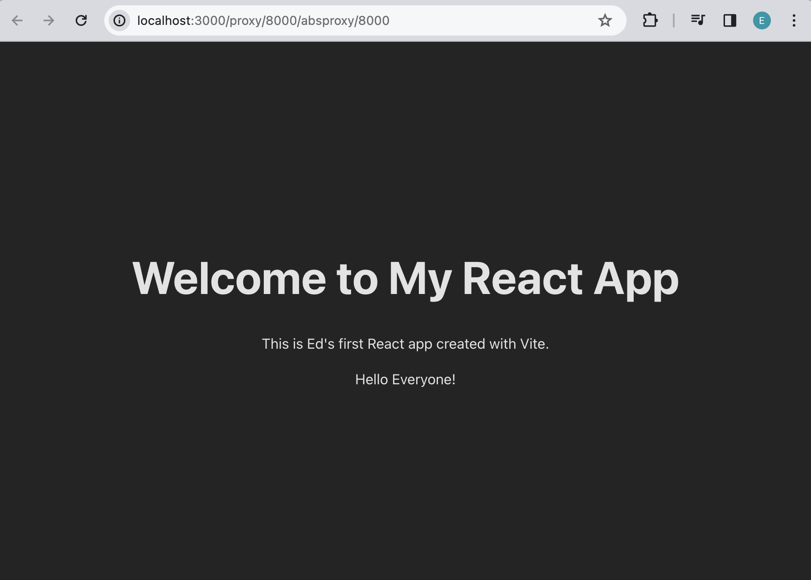

# React Introduction to JSX

Before we begin writing code, let's setup the project and install all necesarry packages.
Open a new Terminal window and do the following steps:

1. Go to `calab` directory:
    ```
    cd calab
    ```
2. Install npm packages:
    ```
    npm install
    ```
3. Start the application:
    ```
    npm run dev
    ```
    You should see the development server being started:
    []() 

    If you open the `Local` URL in a new browser tab, you should see the follwoing:
    []()     
    


### Make First Changes to Your JSX Code

Go to `src/` directory and open `App.jsx` file. Once opened, do the following changes:

1. Change the text displayed inside the `<h1>` element to "Welcome to My React App".
2. Create a new `<p>` element below the `<h1>` element and add the text "This is my first React app created with Vite." inside it.
3. Above the app() function declare a variable `const name` and set it equal to your name.
4. To evaluate the variable declared above, let's create an expression inside the paragraph declared in step `2`. Replace `my` with curly braces, and inside of the curly braces write `name` referencing the variable above.
    ```
    <p>This is {name}'s first React app created with Vite.</p>
    ```

Write a code that can be executed by JSX.

5. After the name variable, let's create a greet() function.
    ```
    const greet = () => "Hello Everyone!"
    ```
6. Evaluate this function in a new paragraph similarly to how variable name was evaluated:
    ```
    <p>{greet()}</p>
    ```

Once you finish with all the steps above, you should see your previously opened React page looking a bit different:
[]()  


